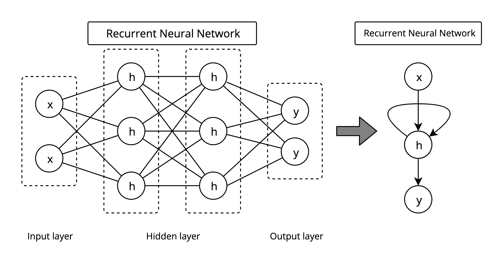
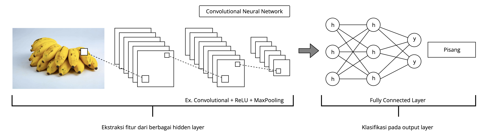

# Week 05 - Deep Learning (Dealing with Sequential Data)

## Dataset

1. Download data IMDB movie review dari [sini](https://www.kaggle.com/datasets/lakshmi25npathi/imdb-dataset-of-50k-movie-reviews)
1. buat direktori dengan nama data
1. Copy file csv ke dalam direktori data

## Pre-trained word-embedding GloVe

1. jalankan ini di terminal
    ```cmd
    wget http://nlp.stanford.edu/data/glove.6B.zip
    ```
1. Buat folder pretrains
1. Copy glove.6B.zip ke dalam folder pretrains

## Konsep RNN dan Perbedaannya dengan CNN

### Recurrent Neural Network

1. Import library yang diperlukan

```python
import torch
import torch.nn as nn
import torch.optim as optim
```

`torch` - Library PyTorch utama.
`torch.nn` - Menyediakan berbagai kelas dan fungsi untuk membangun jaringan saraf.
`torch.optim` - Menyediakan algoritma pengoptimalan seperti SGD dan Adam.

2. Mendefinisikan Model RNN
```python
class SimpleRNN(nn.Module):
    def __init__(self, input_size, hidden_size, output_size):
        super(SimpleRNN, self).__init__()
        self.rnn = nn.RNN(input_size, hidden_size, batch_first=True)  # Layer RNN
        self.fc = nn.Linear(hidden_size, output_size)  # Layer fully connected


    def forward(self, x):
        out, _ = self.rnn(x)  # Proses input melalui RNN
        out = self.fc(out[:, -1, :])  # Ambil output dari langkah waktu terakhir
        return out
```
`self.rnn = nn.RNN(input_size, hidden_size, batch_first=True):` Mendefinisikan layer RNN. Parameter `batch_first=True` menunjukkan bahwa input akan memiliki dimensi batch di posisi pertama (yaitu, bentuk input adalah (`batch_size`, `sequence_length`, `input_size`)).
`self.fc = nn.Linear(hidden_size, output_size):` Mendefinisikan layer fully connected (linear) yang akan mengubah output dari RNN menjadi output akhir
`out, _ = self.rnn(x):` Mengoper input x ke layer RNN.
`out = self.fc(out[:, -1, :]):` Mengambil output dari langkah waktu terakhir. Ini berarti kita hanya mengambil output dari langkah waktu terakhir untuk setiap contoh dalam batch dan mengoper ke layer fully connected.

3. Parameter Model

``` python
input_size = 1  # Jumlah fitur input
hidden_size = 5  # Jumlah neuron di hidden layer
output_size = 1  # Jumlah output
```

4. Membuat instance model
``` python
model = SimpleRNN(input_size, hidden_size, output_size)
```
`model = SimpleRNN(input_size, hidden_size, output_size):` Membuat instance dari model RNN dengan parameter yang telah ditentukan.


5. Mendefinisikan Loss Function dan Optimizer
``` python
criterion = nn.MSELoss()  # Fungsi loss: Mean Squared Error
optimizer = optim.Adam(model.parameters(), lr=0.01)  # Optimizer: Adam
```
`criterion = nn.MSELoss():` Menggunakan Mean Squared Error (MSE) sebagai fungsi loss. Ini digunakan untuk mengukur seberapa baik model memprediksi output.
`optimizer = optim.Adam(model.parameters(), lr=0.01):` Menggunakan algoritma optimasi Adam untuk memperbarui bobot model. `model.parameters()` memberikan semua parameter yang perlu dioptimalkan, dan `lr=0.01` adalah laju pembelajaran.

6. Contoh Data
```python
# Misalkan kita memiliki data sekuensial sederhana
# Input: [1, 2, 3], Target: [4]
x_train = torch.tensor([[[1], [2], [3]]], dtype=torch.float32)  # Bentuk: (batch_size, sequence_length, input_size)
y_train = torch.tensor([[4]], dtype=torch.float32)  # Bentuk: (batch_size, output_size)
```

7. Melatih RNN
```python
num_epochs = 100  # Jumlah epoch untuk pelatihan
for epoch in range(num_epochs):
    model.train()  # Set model ke mode pelatihan

    # Forward pass
    outputs = model(x_train)  # Dapatkan output dari model
    loss = criterion(outputs, y_train)  # Hitung loss

    # Backward pass dan optimasi
    optimizer.zero_grad()  # Reset gradien
    loss.backward()  # Hitung gradien
    optimizer.step()  # Perbarui bobot

    # Cetak loss setiap 10 epoch
    if (epoch + 1) % 10 == 0:
        print(f'Epoch [{epoch + 1}/{num_epochs}], Loss: {loss.item():.4f}')
```

### RNN vs CNN
Arsitektur RNN berbeda dengan CNN, RNN memiliki struktur yang berulang, di mana output dari langkah waktu sebelumnya digunakan sebagai input untuk langkah waktu berikutnya. Ini memungkinkan RNN untuk menyimpan informasi dari langkah waktu sebelumnya dalam hidden state. [contoh kode](../../courses/week05/README.md#recurrent-neural-network).

Sedangkan CNN terdiri dari beberapa lapisan konvolusi diikuti oleh lapisan pooling, yang bertujuan untuk mengurangi dimensi data sambil mempertahankan informasi penting. Setelah lapisan konvolusi dan pooling, data biasanya diratakan (flatten) sebelum diteruskan ke lapisan fully connected. [contoh kode](../../courses/week03/README.md#arsitektur-cnn).

Ilustrasi perbedaan arsitektur RNN dan CNN:






## Long Short-Term Memory (LSTM) dan Gated Recurrent Unit (GRU)

## Implementasi RNN untuk Pemrosesan Bahasa Alami (NLP)

## Studi Kasus: Sentiment Analysis dengan RNN
