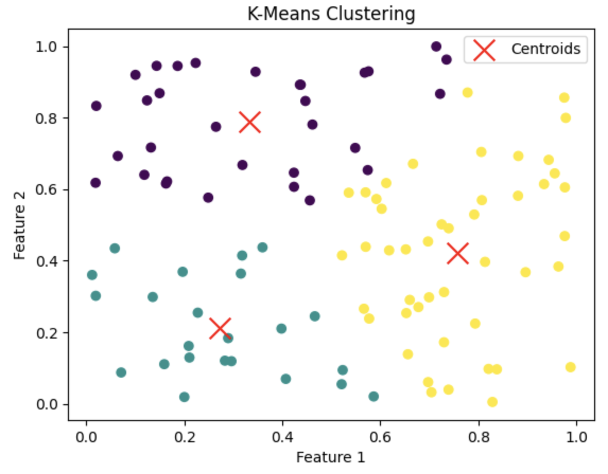
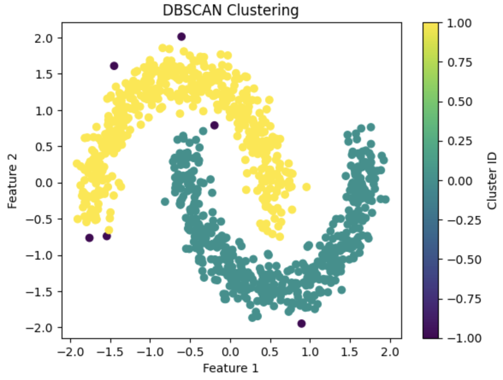
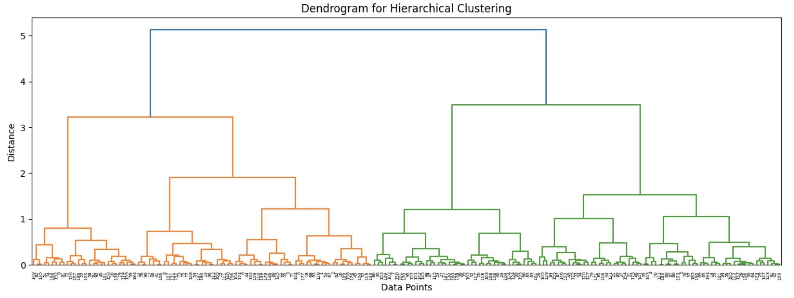
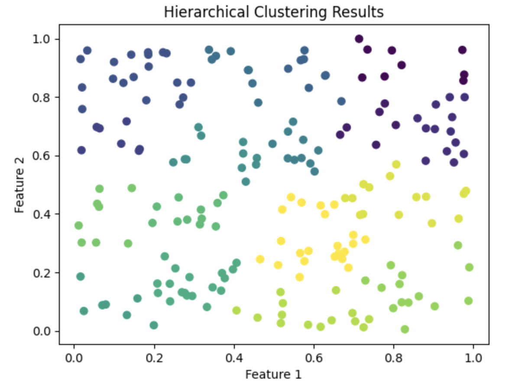

# Clustering dan Generative Models 
##  K-Means, DBSCAN, dan Hierarchical Clustering 

### K-Means
1. Import Library yang Diperlukan

```python
import torch
import numpy as np
import matplotlib.pyplot as plt
```

2. Membuat Data Sederhana
Kita akan membuat data sederhana untuk klasterisasi.

```python
np.random.seed(0)
data = np.random.rand(100, 2)  # 100 on 2D Data
```

3. Inisialisasi Centroid
Kita perlu menginisialisasi centroid untuk kluster.

```python
k = 3  # Number of clusters
centroids = data[np.random.choice(data.shape[0], k, replace=False)]
```

4. Fungsi untuk Menghitung Jarak
Kita perlu menghitung jarak antara data dan centroid.

```python
# We need to calculate the distance between the data and the centroid.
def compute_distances(data, centroids):
    distances = torch.cdist(torch.tensor(data, dtype=torch.float32), 
                             torch.tensor(centroids, dtype=torch.float32))
    return distances
```

5. Algoritma K-Means
Implementasi algoritma K-Means.

```python
# K-Means algorithm
def k_means(data, k, max_iters=100):
    # Inisialisasi centroid
    centroids = data[np.random.choice(data.shape[0], k, replace=False)]
    
    for _ in range(max_iters):
        # Calculate the distance
        distances = compute_distances(data, centroids)
        
        # Define cluster
        labels = torch.argmin(distances, dim=1)
        
        # Update centroid
        for i in range(k):
            centroids[i] = data[labels == i].mean(axis=0)
    
    return centroids, labels
```
6. Menjalankan K-Means
Sekarang kita dapat menjalankan algoritma K-Means pada data kita.

```python
centroids, labels = k_means(data, k)
```

7. Visualisasi Hasil Klasterisasi
Kita dapat memvisualisasikan hasil klasterisasi.

```python
plt.scatter(data[:, 0], data[:, 1], c=labels.numpy(), cmap='viridis', marker='o')
plt.scatter(centroids[:, 0], centroids[:, 1], c='red', marker='x', s=200, label='Centroids')
plt.title('K-Means Clustering')
plt.xlabel('Feature 1')
plt.ylabel('Feature 2')
plt.legend()
plt.show()
```



### DBSCAN

1. Import Library yang Diperlukan
python

```python
import torch
import numpy as np
import matplotlib.pyplot as plt
from sklearn.datasets import make_moons
from sklearn.preprocessing import StandardScaler
```

2. Membuat Data Sederhana
Kita akan membuat data sederhana untuk klasterisasi menggunakan fungsi make_moons dari sklearn.

```python
# Membuat data sederhana
data, _ = make_moons(n_samples=1000, noise=0.1, random_state=0)
data = StandardScaler().fit_transform(data)  # Normalisasi data
```

3. Fungsi untuk Menghitung Jarak
Kita perlu menghitung jarak antara data untuk menentukan kepadatan.

```python
def compute_distances(data):
    distances = torch.cdist(torch.tensor(data, dtype=torch.float32), 
                             torch.tensor(data, dtype=torch.float32))
    return distances
```
4. Implementasi DBSCAN
Implementasi algoritma DBSCAN.

```python
def dbscan(data, eps=0.2, min_samples=5):
    n_samples = data.shape[0]
    labels = -1 * torch.ones(n_samples, dtype=torch.int)  # -1 untuk noise
    visited = torch.zeros(n_samples, dtype=torch.bool)
    cluster_id = 0

    distances = compute_distances(data)

    for i in range(n_samples):
        if visited[i]:
            continue
        visited[i] = True
        neighbors = (distances[i] < eps).nonzero(as_tuple=True)[0]

        if len(neighbors) < min_samples:
            labels[i] = -1  # Mark as noise
        else:
            labels[i] = cluster_id
            while len(neighbors) > 0:
                point = neighbors[0].item()
                if not visited[point]:
                    visited[point] = True
                    new_neighbors = (distances[point] < eps).nonzero(as_tuple=True)[0]
                    if len(new_neighbors) >= min_samples:
                        neighbors = torch.cat((neighbors, new_neighbors))
                if labels[point] == -1:
                    labels[point] = cluster_id
                neighbors = neighbors[1:]
            cluster_id += 1

    return labels
```

5. Menjalankan DBSCAN
Sekarang kita dapat menjalankan algoritma DBSCAN pada data kita.

```python
labels = dbscan(data, eps=0.2, min_samples=5)
```

6. Visualisasi Hasil Klasterisasi
Kita dapat memvisualisasikan hasil klasterisasi.

```python
# Visualisasi hasil
plt.scatter(data[:, 0], data[:, 1], c=labels.numpy(), cmap='viridis', marker='o')
plt.title('DBSCAN Clustering')
plt.xlabel('Feature 1')
plt.ylabel('Feature 2')
plt.colorbar(label='Cluster ID')
plt.show()
```



### Hierarchical Clustering
1. Import Library yang Diperlukan

```python
import torch
import numpy as np
import matplotlib.pyplot as plt
from scipy.cluster.hierarchy import dendrogram, linkage
```

2. Membuat Data Sederhana
Kita akan membuat data sederhana untuk klasterisasi.


```python
# Membuat data sederhana
np.random.seed(0)
data = np.random.rand(200, 2)  # 10 titik data 2D
```

3. Menghitung Linkage Matrix
Kita perlu menghitung linkage matrix yang akan digunakan untuk membangun dendrogram.


```python
# Menghitung linkage matrix
linkage_matrix = linkage(data, method='ward')
```

4. Membuat Dendrogram
Dendrogram adalah representasi visual dari hasil klasterisasi.

```python
# Membuat dendrogram
plt.figure(figsize=(15, 5))
dendrogram(linkage_matrix)
plt.title('Dendrogram for Hierarchical Clustering')
plt.xlabel('Data Points')
plt.ylabel('Distance')
plt.show()
```



5. Menentukan Kluster
Kita dapat menentukan kluster berdasarkan threshold jarak.

```python
from scipy.cluster.hierarchy import fcluster
# Menentukan kluster dengan threshold jarak
threshold = 0.5  # Sesuaikan threshold sesuai kebutuhan
clusters = fcluster(linkage_matrix, threshold, criterion='distance')
```


6. Visualisasi Hasil Klasterisasi
Kita dapat memvisualisasikan hasil klasterisasi.


```python
# Visualisasi hasil klasterisasi
plt.scatter(data[:, 0], data[:, 1], c=clusters, cmap='viridis', marker='o')
plt.title('Hierarchical Clustering Results')
plt.xlabel('Feature 1')
plt.ylabel('Feature 2')
plt.show()
```


##  Generative Adversarial Networks (GANs)

##  Implementasi Clustering dan GANs 